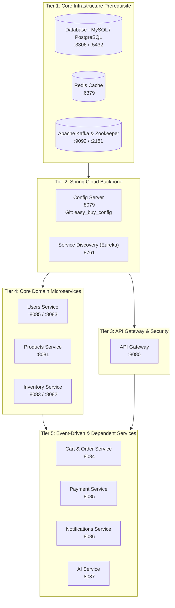
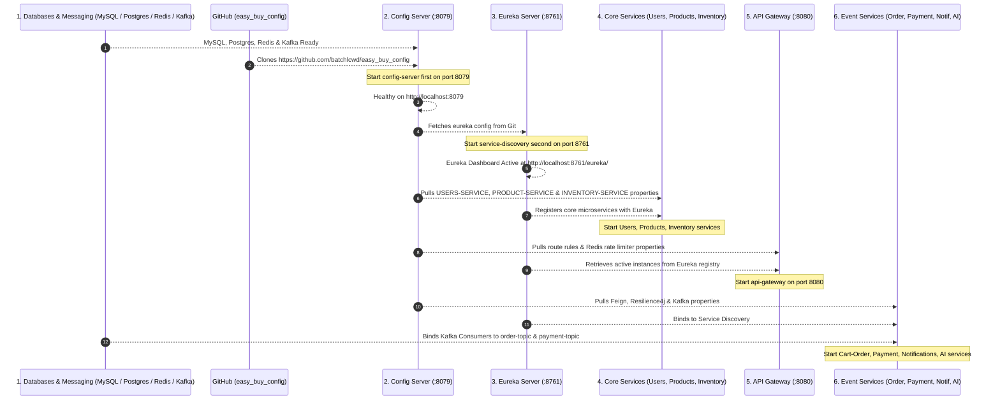

# 🚀 Easy Buy Microservices Startup Order & Dependency Guide

> **Document Version**: `1.2.0`  
> **Target Workspace**: `easy_busy`  
> **Config Server Git Repository**: `https://github.com/batchlcwd/easy_buy_config`  
> **Config Server Base Port**: `8079`  
> **Eureka Service Discovery URL**: `http://localhost:8761/eureka/`  
> **Purpose**: Step-by-step startup guide, dependency matrix, service-by-service environment variables, and Mermaid diagrams for booting Easy Buy microservices.

---

## 📌 Startup Overview & Architecture Tiers

Booting microservices in an incorrect order leads to **Connection Refused**, **Config Server Unreachable**, **Eureka Registration Failures**, or **Kafka Topic Consumer Errors**. 

The boot sequence is divided into **5 sequential tiers**:



---

## ⚙️ Config Server Environment & Global Shared Variables

The Config Server (`CONFIG-SERVER`) boots on port **`8079`** and dynamically fetches property files from:  
👉 **`https://github.com/batchlcwd/easy_buy_config`**

### Global Properties Shared Across All Microservices (`application.yml` in Config Repo)
All microservices dynamically inherit these shared properties upon boot:

| Config Property / Environment Variable | Value / Default | Purpose & Description |
| :--- | :--- | :--- |
| `spring.cloud.config.server.git.uri` | `https://github.com/batchlcwd/easy_buy_config` | Remote Git repository storing profiles |
| `EUREKA_DEFAULT_ZONE` | `http://localhost:8761/eureka/` | Service Discovery registration endpoint |
| `CONFIG_SERVER_URL` | `http://localhost:8079` | Config Server URL imported by microservices |
| `SPRING_KAFKA_BOOTSTRAP_SERVERS` | `localhost:9092` / `kafka:9092` | Kafka broker cluster address |
| `SPRING_DATASOURCE_URL` | `jdbc:mysql://localhost:3306/micro_devops` | Shared MySQL connection URL |
| `PRODUCT_SERVICE_NAME` | `PRODUCT-SERVICE` | Eureka registered name for Product Service |
| `INVENTORY_SERVICE_NAME` | `INVENTORY-SERVICE` | Eureka registered name for Inventory Service |
| `CART_ORDER_SERVICE_NAME` | `CART-ORDER-SERVICE` | Eureka registered name for Cart & Order Service |
| `USERS_SERVICE_NAME` | `USERS-SERVICE` | Eureka registered name for Users Service |
| `PAYMENT_SERVICE_NAME` | `PAYMENT-SERVICE` | Eureka registered name for Payment Service |
| `NOTIFICATIONS_SERVICE_NAME` | `NOTIFICATIONS-SERVICE` | Eureka registered name for Notifications Service |
| `AI_SERVICE_NAME` | `AI-SERVICE` | Eureka registered name for AI Service |

---

## 🔑 Service-by-Service Environment Variables & Configuration

Below is the complete reference of environment variables, database URLs, ports, ImageKit parameters, and Kafka consumer groups for each microservice as declared in `https://github.com/batchlcwd/easy_buy_config`:

### 👤 1. Users Service (`USERS-SERVICE`)
* **Git Config Files**: `USERS-SERVICE-dev.properties`, `USERS-SERVICE-prod.properties`
* **Port**: `8085` (prod/k8s) / `8083` (dev)

| Variable / Property | Dev Profile Value | Prod Profile Value | Purpose |
| :--- | :--- | :--- | :--- |
| `SPRING_DATASOURCE_URL` | `jdbc:mysql://localhost:3306/micro_devops` | `jdbc:mysql://mysql:3306/easybuy_users` | MySQL Database URL |
| `SPRING_DATASOURCE_USERNAME` | `root` | `root` | Database Username |
| `SPRING_DATASOURCE_PASSWORD` | `root123` | `securepassword` | Database Password |
| `jwt.secret` | `5367566B59703373367639792F423F4528...` | `5367566B59703373367639792F423F4528...` | HMAC-SHA256 secret for signing JWT tokens |
| `spring.datasource.hikari.maximum-pool-size` | `10` | `20` | Maximum DB connection pool size |

---

### 📦 2. Products Service (`PRODUCT-SERVICE`)
* **Git Config Files**: `PRODUCT-SERVICE-dev.properties`, `PRODUCT-SERVICE-prod.properties`
* **Port**: `8081`

| Variable / Property | Dev Profile Value | Prod Profile Value | Purpose |
| :--- | :--- | :--- | :--- |
| `spring.datasource.url` | `jdbc:postgresql://localhost:5432/productdb` | `jdbc:postgresql://postgres:5432/productdb` | PostgreSQL Database URL |
| `spring.datasource.username` | `user` | `root` | PostgreSQL Username |
| `spring.datasource.password` | Encrypted Cipher | `securepassword` | PostgreSQL Password |
| `imagekit.id` | `batchlcwd` | `batchlcwd` | ImageKit Account ID |
| `imagekit.public-key` | `public_AksrYlt8twF6jRum4Ya+MbQcLCg=` | `public_AksrYlt8twF6jRum4Ya+MbQcLCg=` | ImageKit API Public Key |
| `imagekit.private-key` | `private_/V3EMSmNRaUXenhWj9E/PnnsKc8=` | `private_/V3EMSmNRaUXenhWj9E/PnnsKc8=` | ImageKit API Private Key |
| `imagekit.url-endpoint` | `https://ik.imagekit.io/batchlcwd` | `https://ik.imagekit.io/batchlcwd` | ImageKit CDN Endpoint |
| `imagekit.folder` | `/products` | `/products_production` | Target folder for product images |

---

### 🏭 3. Inventory Service (`INVENTORY-SERVICE`)
* **Git Config Files**: `INVENTORY-SERVICE-dev.properties`, `INVENTORY-SERVICE-prod.properties`
* **Port**: `8083` (prod) / `8082` (dev)

| Variable / Property | Dev Profile Value | Prod Profile Value | Purpose |
| :--- | :--- | :--- | :--- |
| `SPRING_DATASOURCE_URL` | `jdbc:mysql://localhost:3306/micro_devops` | `jdbc:mysql://mysql:3306/easybuy_inventory` | Inventory MySQL Database URL |
| `SPRING_DATASOURCE_USERNAME` | `root` | `root` | Database Username |
| `SPRING_DATASOURCE_PASSWORD` | `root123` | `securepassword` | Database Password |
| `SPRING_KAFKA_BOOTSTRAP_SERVERS` | `localhost:9092` | `kafka:9092` | Kafka Broker address |
| `spring.kafka.consumer.group-id` | `order-group` | `inventory-prod-group` | Kafka Consumer Group ID |
| `spring.kafka.consumer.properties.spring.json.value.default.type` | `com.substring.easybuy.common.events.PaymentEvent` | `com.substring.easybuy.common.events.PaymentEvent` | Kafka Deserialization target type |

---

### 🛒 4. Cart & Order Service (`CART-ORDER-SERVICE`)
* **Git Config Files**: `CART-ORDER-SERVICE-dev.properties`, `CART-ORDER-SERVICE-prod.properties`
* **Port**: `8084`

| Variable / Property | Dev Profile Value | Prod Profile Value | Purpose |
| :--- | :--- | :--- | :--- |
| `SPRING_DATASOURCE_URL` | `jdbc:mysql://localhost:3306/micro_devops` | `jdbc:mysql://mysql:3306/easybuy_cart_order` | Orders MySQL Database URL |
| `SPRING_DATASOURCE_USERNAME` | `root` | `root` | Database Username |
| `SPRING_DATASOURCE_PASSWORD` | `root123` | `securepassword` | Database Password |
| `PRODUCT_SERVICE_NAME` | `${PRODUCT_SERVICE_NAME}` (`PRODUCT-SERVICE`) | `${PRODUCT_SERVICE_NAME}` | Eureka client service name for Product Service |
| `INVENTORY_SERVICE_NAME` | `${INVENTORY_SERVICE_NAME}` (`INVENTORY-SERVICE`) | `${INVENTORY_SERVICE_NAME}` | Eureka client service name for Inventory Service |
| `INVENTORY_SERVICE_URL` | `http://localhost:8083` | `http://inventory-service:8083` | Direct fallback base URL for Inventory Service |
| `SPRING_KAFKA_BOOTSTRAP_SERVERS` | `localhost:9092` | `kafka:9092` | Kafka Broker address |
| `spring.kafka.consumer.group-id` | `order-group` | `order-prod-group` | Kafka Consumer Group ID |
| `resilience4j.circuitbreaker.configs.default.failureRateThreshold` | `50` | `50` | Circuit Breaker failure threshold % |
| `resilience4j.retry.configs.default.maxAttempts` | `3` | `3` | Feign call retry limit |

---

### 💳 5. Payment Service (`PAYMENT-SERVICE`)
* **Git Config Files**: `PAYMENT-SERVICE-dev.properties`, `PAYMENT-SERVICE-prod.properties`
* **Port**: `8085`

| Variable / Property | Dev Profile Value | Prod Profile Value | Purpose |
| :--- | :--- | :--- | :--- |
| `SPRING_DATASOURCE_URL` | `jdbc:mysql://localhost:3306/micro_devops` | `jdbc:mysql://mysql:3306/easybuy_payment` | Payments MySQL Database URL |
| `SPRING_DATASOURCE_USERNAME` | `root` | `root` | Database Username |
| `SPRING_DATASOURCE_PASSWORD` | `root123` | `securepassword` | Database Password |
| `SPRING_KAFKA_BOOTSTRAP_SERVERS` | `localhost:9092` | `kafka:9092` | Kafka Broker address |
| `spring.kafka.consumer.group-id` | `payment-group` | `payment-prod-group` | Kafka Consumer Group ID |
| `spring.kafka.consumer.properties.spring.json.value.default.type` | `com.substring.easybuy.common.events.OrderEvent` | `com.substring.easybuy.common.events.OrderEvent` | Deserializes incoming order events |

---

### 🔔 6. Notifications Service (`NOTIFICATIONS-SERVICE`)
* **Git Config Files**: `NOTIFICATIONS-SERVICE-prod.properties`
* **Port**: `8086` / `8080`

| Variable / Property | Value | Purpose |
| :--- | :--- | :--- |
| `SPRING_DATASOURCE_URL` | `jdbc:mysql://mysql:3306/easybuy_notifications` | Notifications DB URL |
| `SPRING_DATASOURCE_USERNAME` | `root` | Database Username |
| `SPRING_DATASOURCE_PASSWORD` | `securepassword` | Database Password |
| `SPRING_KAFKA_BOOTSTRAP_SERVERS` | `kafka:9092` | Kafka Broker address |
| `spring.kafka.consumer.group-id` | `notification-group` | Kafka Consumer Group ID for `order-topic` |
| `SPRING_MAIL_HOST` | `${SPRING_MAIL_HOST:smtp.gmail.com}` | SMTP Server Host |
| `SPRING_MAIL_PORT` | `${SPRING_MAIL_PORT:25}` | SMTP Port |

---

### 🤖 7. AI Service (`AI-SERVICE`)
* **Git Config Files**: `AI-SERVICE-prod.properties`
* **Port**: `8087` / `8080`

| Variable / Property | Value | Purpose |
| :--- | :--- | :--- |
| `SPRING_DATASOURCE_URL` | `jdbc:mysql://mysql:3306/easybuy_ai` | AI Service DB URL |
| `SPRING_DATASOURCE_USERNAME` | `root` | Database Username |
| `SPRING_DATASOURCE_PASSWORD` | `securepassword` | Database Password |

---

### 🛡️ 8. API Gateway (`api-gateway`)
* **Config File**: `api-gateway/src/main/resources/application.yaml`
* **Port**: `8080`

| Variable / Property | Value | Purpose |
| :--- | :--- | :--- |
| `server.port` | `8080` | External Gateway entry port |
| `spring.data.redis.host` | `localhost` / `redis` | Redis host for Rate Limiter |
| `spring.data.redis.port` | `6379` | Redis port |
| `CONFIG_SERVER_URL` | `http://localhost:8079` | Config Server URL |
| `jwt.secret` | `5367566B59703373367639792F423F4528...` | Secret key to verify client JWTs |
| `PRODUCT_SERVICE_NAME` | `PRODUCT-SERVICE` | Gateway routing target for `/products/**` |
| `CARD_ORDER_SERVICE_NAME` | `CART-ORDER-SERVICE` | Gateway routing target for `/cart-orders/**` |
| `USERS_SERVICE_NAME` | `users-service` | Gateway routing target for `/users/**` |
| `INVENTORY_SERVICE_NAME` | `INVENTORY-SERVICE` | Gateway routing target for `/inventories/**` |

---

## ⏱️ Detailed Startup Sequence Diagram

The sequence diagram below shows the startup order, configuration retrieval from GitHub via Config Server (`:8079`), Eureka registration (`:8761`), and service initialization:



---

## 📋 Step-by-Step Service Startup Guide

### 📍 Step 1: Infrastructure & Storage (Tier 1)

1. **Databases** (`:3306` MySQL / `:5432` PostgreSQL)
   * **Required Databases**: `micro_devops`, `easybuy_users`, `easybuy_inventory`, `easybuy_cart_order`, `easybuy_payment`, `easybuy_notifications`, `easybuy_ai` (MySQL) and `productdb` (PostgreSQL).
2. **Redis Cache** (`:6379`)
   * Used by API Gateway for Redis Rate Limiting.
3. **Zookeeper & Apache Kafka** (`:2181` / `:9092`)
   * Used for async event streaming (`order-topic`, `payment-topic`).

---

### 📍 Step 2: Spring Cloud Central Backbone (Tier 2)

#### 1. Config Server (`config-server`)
* **Port**: **`8079`**
* **Git Repository**: `https://github.com/batchlcwd/easy_buy_config`
* **Command**:
  ```powershell
  mvn spring-boot:run
  ```
* **Health Check**: `http://localhost:8079/actuator/health` or `http://localhost:8079/PRODUCT-SERVICE/dev`

#### 2. Service Discovery / Eureka (`service-discovery`)
* **Port**: **`8761`**
* **Eureka Default Zone**: `http://localhost:8761/eureka/`
* **Command**:
  ```powershell
  mvn spring-boot:run
  ```
* **Health Check**: Open Eureka Dashboard at `http://localhost:8761`.

---

### 📍 Step 3: Core Domain Microservices (Tier 3)

| Order | Service Name | Directory | Default Port | Config File in Git Repo | Key Variables Used |
| :---: | :--- | :--- | :---: | :--- | :--- |
| **3.1** | `users-service` | `users-service/users-service` | `8085` / `8083` | `USERS-SERVICE-dev.properties` | `SPRING_DATASOURCE_URL`, `SPRING_DATASOURCE_USERNAME` |
| **3.2** | `products-service` | `products-service/products-service` | `8081` | `PRODUCT-SERVICE-dev.properties` | PostgreSQL URL, `imagekit.url-endpoint` |
| **3.3** | `inventory-service` | `inventory-service/inventory-service` | `8083` / `8082` | `INVENTORY-SERVICE-dev.properties` | `SPRING_DATASOURCE_URL`, `SPRING_KAFKA_BOOTSTRAP_SERVERS` |

---

### 📍 Step 4: API Gateway & Edge Security (Tier 4)

#### `api-gateway`
* **Port**: **`8080`**
* **Config Import**: `configserver:http://localhost:8079`
* **Redis Port**: `6379`
* **Command**:
  ```powershell
  mvn spring-boot:run
  ```
* **Health Check**: `http://localhost:8080/actuator/health`

---

### 📍 Step 5: Event-Driven & Transactional Microservices (Tier 5)

| Order | Service Name | Directory | Default Port | Config File in Git Repo | Key Inter-Service Variables |
| :---: | :--- | :--- | :---: | :--- | :--- |
| **5.1** | `cart-order-service` | `cart-order-service/cart-order-service` | `8084` | `CART-ORDER-SERVICE-dev.properties` | `INVENTORY_SERVICE_NAME`, `PRODUCT_SERVICE_NAME`, `SPRING_KAFKA_BOOTSTRAP_SERVERS` |
| **5.2** | `payment-service` | `payment-service/payment-service` | `8085` | `PAYMENT-SERVICE-dev.properties` | `SPRING_KAFKA_BOOTSTRAP_SERVERS`, `payment-group` |
| **5.3** | `notifications-service`| `notifications-service/notifications-service` | `8086` | `NOTIFICATIONS-SERVICE-prod.properties` | `SPRING_MAIL_PORT`, `order-topic` |
| **5.4** | `ai-service` | `ai-service/ai-service` | `8087` | `AI-SERVICE-prod.properties` | `AI_SERVICE_NAME` |

---

## 📊 Summary Matrix: Service Ports, Config & Health Checks

| Boot Order | Component / Service | Config / Port Source | Port | Health Check / Validation URL |
| :---: | :--- | :--- | :---: | :--- |
| 1 | MySQL Database | `k8s/eks/02-instfastructure.yml` | `3306` | `mysql -u root -p -e "SHOW DATABASES;"` |
| 2 | Redis Server | `api-gateway/application.yaml` | `6379` | `redis-cli ping` |
| 3 | Apache Kafka | `docker/docker-compose.yml` | `9092` | TCP check `localhost:9092` |
| 4 | `config-server` | `config-server/application.yaml` | **`8079`** | `http://localhost:8079/actuator/health` |
| 5 | `service-discovery` | `service-discovery/application.yaml` | **`8761`** | `http://localhost:8761/eureka/` |
| 6 | `users-service` | `USERS-SERVICE-dev.properties` | `8085` / `8083` | `http://localhost:8083/actuator/health` |
| 7 | `products-service` | `PRODUCT-SERVICE-dev.properties` | `8081` | `http://localhost:8081/actuator/health` |
| 8 | `inventory-service` | `INVENTORY-SERVICE-dev.properties` | `8083` / `8082` | `http://localhost:8082/actuator/health` |
| 9 | `api-gateway` | `api-gateway/application.yaml` | **`8080`** | `http://localhost:8080/actuator/health` |
| 10 | `cart-order-service` | `CART-ORDER-SERVICE-dev.properties` | `8084` | `http://localhost:8084/actuator/health` |
| 11 | `payment-service` | `PAYMENT-SERVICE-dev.properties` | `8085` | `http://localhost:8085/actuator/health` |
| 12 | `notifications-service` | `NOTIFICATIONS-SERVICE-prod.properties` | `8086` | `http://localhost:8086/actuator/health` |
| 13 | `ai-service` | `AI-SERVICE-prod.properties` | `8087` | `http://localhost:8087/actuator/health` |

---

## 🐳 Docker Compose Alternative

```powershell
# Boot infrastructure first
docker-compose up -d mysql redis kafka zookeeper

# Boot Spring Cloud backbone (Config server pulls from https://github.com/batchlcwd/easy_buy_config)
docker-compose up -d config-server service-discovery

# Boot Gateway & Microservices
docker-compose up -d api-gateway users-service products-service inventory-service cart-order-service payment-service notifications-service ai-service
```
